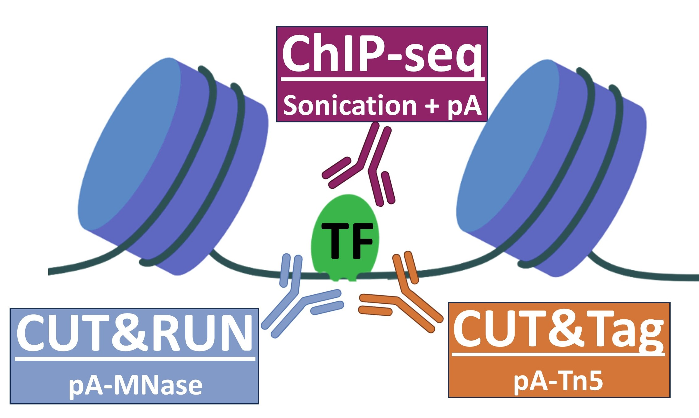
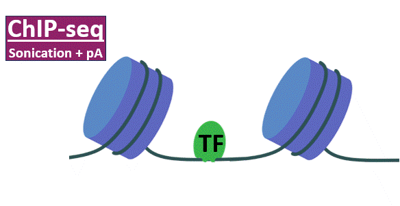
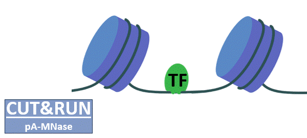
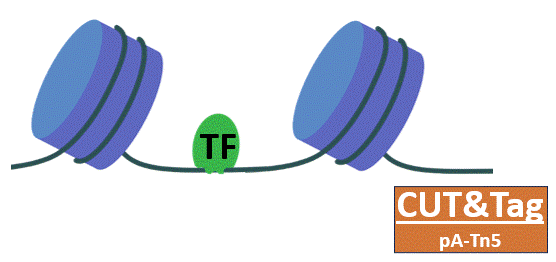
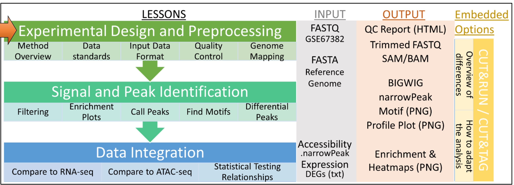
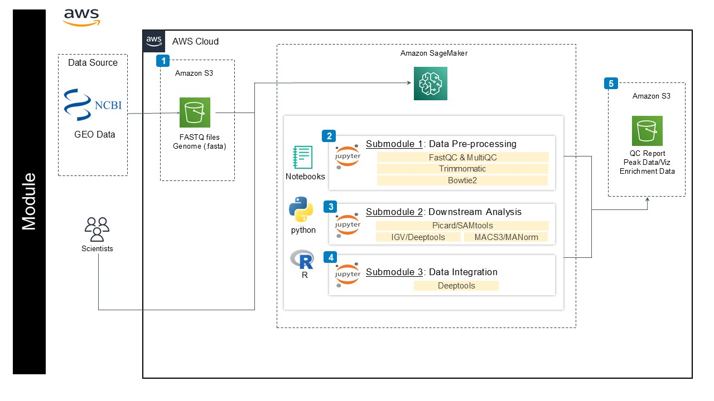
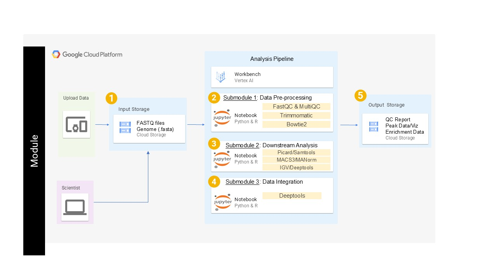

# Exploring Chromatin Occupancy with ChIP-seq, CUT&RUN, or CUT&Tag
---------------------------------

## **Contents**

+ [Overview](#overview)
+ [Background](#background)
+ [Before Starting](#before-starting)
+ [Getting Started](#getting-started)
+ [Software Requirements](#software-requirements)
+ [Architecture Design](#architecture-design)
+ [Data](#data)
+ [Funding](#funding)
+ [License for Data](#license-for-data)

## **Overview**

This module covers the basic analysis and considerations for ChIP-seq, CUT&RUN, and CUT&Tag. Topics include quality control, filtering, alignment, deduplication, peak identification, visualization, and differential analysis of occupancy. Throughout the module, you can explore different considerations for each method as well as unifying themes. This pipeline tutorial is divided into three submodules, which can be taken one after the other, or as standalone lessons covering preprocessing, differential and downstream analysis, and integration of ATAC-seq and RNA-seq. 

## **Background**

There are several reasons to explore the occupancy of proteins on chromatin. ChIP-seq, CUT&RUN, and CUT&Tag represent three high-throughput sequencing approaches to profile chromatin occupancy genome-wide. These approaches have been used to measure histone modifications, RNA polymerases, architectural proteins, and transcription factors, to name a few. These approaches use an antibody to selectively isolate DNA fragments bound by a protein of interest. While these three approaches share some similarities, there are differences that should be taken into consideration when planning experiments and during the analysis of the data. 

### **ChIP-seq**

Most ChIP-seq protocols start with chemical crosslinking (e.g. formaldehyde) to stabilize protein-DNA complexes. Chromatin is then sonicated to produce short fragments from (semi)random breaks. Next, an antibody is used in conjunction with protein A (or G) conjugated beads (usually magnetic) to immunoprecipitate DNA fragments that were bound by the protein of interest. These immunoprecipitates are then de-crosslinked, DNA is purified, undergoes sequencing library preparation, PCR amplification, and sequencing. 

**Bench Time:** ~ 3-5 days.
**# of Cells:** Typically millions of cells (depending on IP efficiency, protein prevalence, and genome size).
**Sequencing Depth:** Typically 20-40 million reads (depending on genome size).
**Contrast:** Crosslinking allows stopping processes in a fine-scale timing. ChIP-seq has been a tried and tested staple, such that numerous antibodies have been validated specifically for this method.

### **CUT&RUN**

Unlike ChIP-seq, CUT&RUN protocols typically do not include a crosslinking step. While some protocols can include a light crosslinking, the DNA fragments need to be able to diffuse out of the nucleus. In CUT&RUN, cells (or nuclei) are stablized using concavalin beads, after which an antibody is used to direct protein A (or G) MNase, where it will cut the DNA directly next to the protein of interest. These fragments are collected, undergo sequencing library preparation, PCR amplification, and sequencing.

**Bench Time:** ~ 1-2 days.
**# of Cells:** Thousands (5,000-500,000) (depending on IP efficiency, protein prevalence, and genome size).
**Sequencing Depth:** Typically 3-10 million reads (depending on genome size).
**Contrast:** Antibodies that have been tested for ChIP-seq, may not always work as efficiently for CUT&RUN.

### **CUT&Tag**

Similar to CUT&RUN, the CUT&Tag method does not include crosslinking. In CUT&Tag, an antibody is used to direct protein A (or G) Tn5, a transposase that inserts short adapters into the DNA directly next to where the protein of interest is bound. This simultaneously fragments the DNA and adds adapters, allowing direct sequencing library preparation by PCR amplification.

**Bench Time:** ~ 1 day.
**# of Cells:** Thousands (<1,000-100,000) (depending on IP efficiency, protein prevalence, and genome size).
**Sequencing Depth:** Typically 3-10 million reads (depending on genome size).
**Contrast:** Antibodies that have been tested for ChIP-seq, may not always work as efficiently for CUT&Tag. CUT&Tag is most commonly used for histone modifications because the salt concentration in CUT&Tag makes it typically less suited for transcription factors. Indeed, adjusting the salt concentration has been puposefully used in [CUTAC](https://elifesciences.org/articles/63274) to profile accessibility near proteins of interest.

### **Analysis**
This module explores the analysis of ChIP-seq, CUT&RUN, and CUT&Tag, including preprocessing, peak identification, visualization of signal, differential analysis, and some aspects of downstream analysis integrating protein occupancy with accessibilty from ATAC-seq and differential gene expression from RNA-seq. The differences between ChIP-seq, CUT&RUN, and CUT&Tag can impact choices in the analysis, and we highlight a few throughout the modules. 

## **Before Starting**

These tutorials were designed to be used on cloud computing platforms, with the aim of requiring nothing but the files within this GitHub repository in conjunction with downsampled example datasets held in cloud storage. Throughout the modules, you will see how to access these exmaple datasets. 

With this in mind, our tutorials use Jupyter Notebook files, which Google Cloud Platform, Amazon Web Services, and Microsoft Azure all provide support for. Therefore, requirements should only require creation of a virtual machine on one of these providers, and the downloading of this repositories files to the machine. 

## **Getting Started**
This repository contains several notebook files which serve as bioinformatics workflow tutorials that should work on any system that runs jupyter lab, and was specifically designed for Amazon Web Services (AWS) and the Google Cloud Platform (GCP). 

## **Software Requirements**
Because this module is hosted on cloud platforms and implemented in Jupyter Lab, the tools required throughout the module are configures via miniconda. Any system with a bash environment running Jupyter Lab should be able to run the module.

## **Architecture Design**
This module was developed in Jupyter Lab on AWS Sagemaker.

It can also be run in Jupyter Lab on GCP Vertex AI.

Cloning this repository will include all files necessary for the module. Some example files are held in cloud-based storage, with instructions on how to access that storage embedded within the notebooks. 

## **Data**

## **Funding**

## **License for Data**

